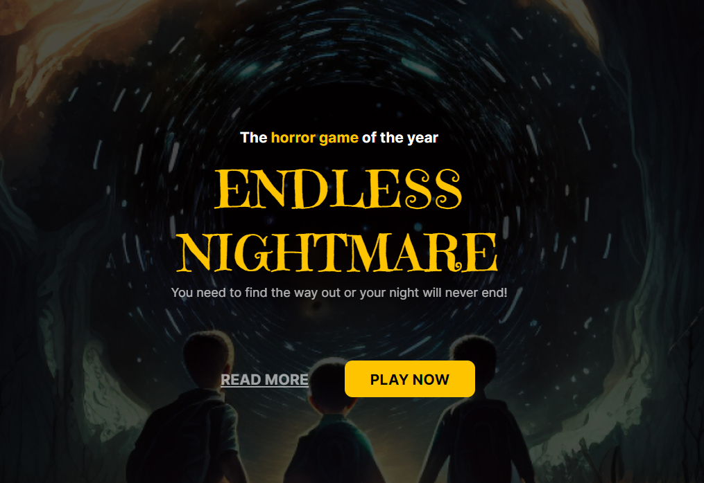

<h1 align="center">🧌The Horror Game</h1>

Esta landing page é baseada em jogos de terror

    

## 🧑‍💻 Tecnologia Utilizadas
- HTML
- CSS
- Figma
- Git/Github

## 🖼️ Layout
O layout do projeto pode ser visualizado através desse [LINK](https://www.figma.com/file/kxphE1xVuDY9S1IY90Wkdm/Horror-Game-LP-(Community)?node-id=0-1&t=0M5M6WX4uvJuI1E7-0). É necessário ter uma conta no [FIGMA](https://www.figma.com/) para acessá-lo.

## ✍️ Licensa

  

